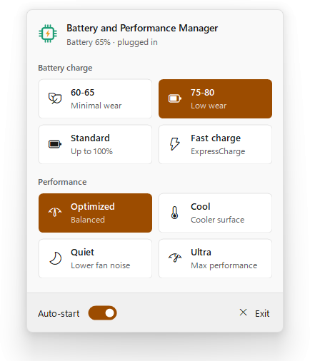

<p align="center"></p>

# Battery and Performance Manager

A Windows tray app for Dell laptops that switches the battery charge profile
and the Dell Optimizer thermal mode (Optimized / Cool / Quiet / Ultra
Performance) with a single click from the system tray — no UAC prompts, and
the tray app itself never runs as administrator.

<p align="center">
  <picture>
    <source media="(prefers-color-scheme: dark)" srcset="assets/screenshot-dark.png">
    
  </picture>
  <br>
  <sub>The flyout follows the Windows light/dark mode and accent color.</sub>
</p>

It talks to the BIOS through Dell's `DellBIOSProvider` PowerShell module and
to Dell Optimizer through its own CLI, via a persistent elevated helper
([`BatteryPerformanceHelper.ps1`](BatteryPerformanceHelper.ps1)) that avoids
the per-click elevation cost — see [Architecture](#architecture) and
[Thermal mode](#thermal-mode) below. Developed and tested on a Dell XPS 14.

## Install

**Requirements**

- A Dell laptop whose BIOS supports custom battery charge settings
- [Dell Optimizer](https://www.dell.com/support) installed, for the
  Performance (thermal mode) choices
- Windows 10 or 11, 64-bit, with your account in the local Administrators group

**Steps**

1. Download `BatteryPerformanceManager-<version>-win-x64.zip` from the
   [latest release](https://github.com/proxjack/BatteryPerformanceManager/releases/latest).
2. Extract the whole zip (right-click > *Extract All…*).
3. Double-click `Install.cmd` and confirm the administrator prompt. The app
   isn't code-signed, so Windows may warn you first: choose *More info* >
   *Run anyway* (SmartScreen) or *Run* (security warning).
4. Click the new icon in the system tray, next to the clock.

The installer ([`installer/Install.ps1`](installer/Install.ps1)):

- copies the app to `C:\Program Files\Battery and Performance Manager` — a
  folder only administrators can change, which matters because the helper
  script there runs elevated without a UAC prompt;
- installs the `DellBIOSProvider` module from the PowerShell Gallery if it's
  missing, and warns if the BIOS or Dell Optimizer can't be used;
- registers the elevated helper task (`\BatteryPerformanceManager\Helper`);
- adds a Start menu shortcut, an entry in *Settings > Apps* and auto-start at
  login (you can turn it off in the app), then starts the app.

Running `Install.cmd` from a newer release upgrades an existing installation
in place.

**Uninstall** from *Settings > Apps > Installed apps > Battery and
Performance Manager*, or double-click `Uninstall.cmd` in the program folder.
It removes the app, the helper task, the shortcut and auto-start; it leaves
your settings folder (`%APPDATA%\BatteryPerformanceManager`), the
`DellBIOSProvider` module and the current charge/thermal settings as they are.

## Using it

Click the tray icon (left or right) to open a Windows 11 style flyout above
the tray, with the battery status, a tile for each charge profile and
thermal mode, the auto-start switch and Exit. The active tiles are filled
with the Windows accent color; the one being applied shows a spinner and
"Applying…", and a tile whose switch failed shows "Couldn't apply" for a few
seconds (details in `errors.log`). The flyout closes when you click anywhere
else or press Esc.

The choices are:

- **Battery charge**: **60-65** (minimal wear) / **75-80** (low wear) /
  **Standard** (charges up to 100%) / **Fast charge** (ExpressCharge) —
  applies the corresponding profile (no UAC prompt, no visible window). The
  first switch of a session takes ~10-12s (the helper is starting up); every
  switch after that is typically under 2 seconds.
- **Performance** (thermal mode): **Optimized** / **Cool** / **Quiet** / **Ultra
  Performance** — same as picking it in Dell Optimizer. The active one is the
  mode currently set in Dell Optimizer, even if it was changed from there.
- **Auto-start** — enables/disables the tray app starting at login (switch)
- **Exit**

The flyout follows the Windows light/dark mode and accent color (Settings >
Personalization > Colors), read every time it opens.

The last successfully applied charge profile stays marked as active even
after restarting the app or the PC — it's purely a visual indicator, **it is
never reapplied automatically**. The same goes for the thermal mode: nothing
is reapplied at startup.

### Checking the current state

To verify what's actually set on the BIOS right now (independent of the tray
app's own state file), run, as administrator, from the program folder:

```powershell
.\Get-DellBatteryChargeState.ps1
```

It prints `PrimaryBattChargeCfg`, `CustomChargeStart`, `CustomChargeStop`, and
which of the 4 profiles they currently match. Read-only, changes nothing.

For the thermal mode, as administrator:

```powershell
& "C:\Program Files\Dell\DellOptimizer\do-cli.exe" /get -name=SystemPowerConfiguration.ThermalMode
```

### If something goes wrong

The interface is deliberately minimal: **no popups, no toast notifications**.
If a profile or thermal mode switch fails (helper task not found → setup
hasn't been run yet, connecting to the pipe timed out, or the helper rejected
the request — BIOS path unavailable, values out of range, `do-cli.exe`
missing or returning an error), the detail is written to:

```
%APPDATA%\BatteryPerformanceManager\errors.log
```

The last applied profile and thermal mode are stored in
`%APPDATA%\BatteryPerformanceManager\state.json`.

The detailed log the helper writes on every charge switch (state before/after)
is `dell-battery-charge-log.jsonl`, next to the helper script (in the program
folder, for an installed copy). Every thermal switch (requested mode,
`do-cli.exe` exit code, duration and output) goes to
`dell-thermal-mode-log.jsonl`, in the same folder.

After updating `BatteryPerformanceHelper.ps1`, an already-running helper keeps the
old code until it exits: log off and back in, or end it with
`schtasks /End /TN "\BatteryPerformanceManager\Helper"` (no admin needed) — the
next click starts it again. The installer does this for you.

## How it works (short version)

1. **One-time setup**, as administrator (done by the installer):
   [`setup-scheduled-tasks.ps1`](setup-scheduled-tasks.ps1) creates a single
   Windows Scheduled Task (`\BatteryPerformanceManager\Helper`), configured to run
   with the highest privileges but with **no automatic trigger** — it only
   starts on demand, and runs silently (no visible console window).
2. **Day to day**: the tray app (`BatteryPerformanceManager.exe`), which runs WITHOUT admin
   privileges, talks to that helper over a local named pipe when you pick a
   profile in its flyout. The first switch of a login session starts the
   helper task (elevated, no UAC prompt — see below); every switch after that
   just sends a request to the already-running helper, no new process
   involved.

## Architecture

Earlier version of this app created one Scheduled Task per profile and ran a
brand-new elevated `powershell.exe` process for every single click. That
process creation cost **10-12 seconds** on real hardware — not the actual BIOS
write (`Import-Module DellBIOSProvider` + the `Set-Item` calls together take
well under a second), but the generic overhead of launching a *new elevated
process*, most likely real-time antivirus scanning of it. This was verified
to be independent of the Scheduled Task mechanism itself: manually elevating
the same command with `Start-Process -Verb RunAs` measured the same ~12s.

The fix: instead of a fresh process per click, a single persistent elevated
helper (`BatteryPerformanceHelper.ps1`) is started once — on the first profile
switch of a login session — and stays running in the background, listening
on a named pipe (`BatteryPerformanceManagerHelper`, ACL-restricted to the current
user's SID so no other local account/process can send it commands). It
imports `DellBIOSProvider` once and keeps the `DellSmbios:` drive mounted, so
every subsequent switch is just a round-trip over the pipe — typically under
2 seconds. The helper has no explicit time limit and simply exits when the
user logs off (it runs under a `LogonType Interactive` Scheduled Task, which
Windows terminates automatically at logoff).

Why the elevation still works without a UAC prompt: when a non-elevated
process starts an *already-registered* task with `RunLevel=Highest` through
the Task Scheduler API — not by launching the executable directly — the Task
Scheduler service (running as SYSTEM) creates the process with the user's
elevated token directly. It doesn't go through the interactive
AppInfo/consent-prompt path that triggers when a user manually elevates a
program. This only works because the current user is actually a member of
the local Administrators group — and it's why the helper script must live in
a folder standard processes can't write to (the installer uses Program Files).

## Thermal mode

The thermal mode is **not** a `DellBIOSProvider` attribute on this XPS 14
(`DellSmbios:\PowerManagement\ThermalManagement` does not exist). Dell
Optimizer sets it through the BIOS SMBIOS interface ("User Selectable Thermal
Tables"), so the helper goes through Dell Optimizer's official CLI instead:

```
"C:\Program Files\Dell\DellOptimizer\do-cli.exe" /configure -name=SystemPowerConfiguration.ThermalMode -value=<Optimized|Cool|Quiet|Ultra>
```

`do-cli.exe` requires administrator rights, which the helper already has. The
result is exactly the same as clicking the mode in Dell Optimizer's own UI —
including Dell Optimizer's sync with the Windows power mode (with "Sync with
Windows power mode" on, which is the default, Ultra also switches Windows to
"Best performance", and changing the Windows power mode can change the thermal
mode back). **Dell Optimizer must therefore stay installed.**

Over the pipe, a thermal request is `thermal:<mode>` (`thermal:optimized`,
`thermal:cool`, `thermal:quiet`, `thermal:ultra`); charge profile requests are
unchanged.

Since the mode can change outside this app (Dell Optimizer, Windows power
mode), the flyout re-reads the current one every time it opens, without
elevation, from Dell Optimizer's
`%ProgramData%\{DataFolderName}\DellOptimizer\TelemetrySettings.json`
(`DataFolderName` is under `HKLM\SOFTWARE\DELL\DellOptimizer`). That's an
internal Dell file, not a documented interface: if it can't be read, the
flyout falls back to the last mode applied by this app.

## Known BIOS quirk: profile switch ordering

The DellBIOSProvider validates each write to `CustomChargeStart` /
`CustomChargeStop` against the *current* value of the other bound, not the
final pair — so moving from a lower custom range to a higher one (e.g.
60-65 → 75-80) fails if `Start` is written before `Stop` is raised. Both
`Set-DellBatteryChargeProfile.ps1` and `BatteryPerformanceHelper.ps1` handle this
by writing `Stop` first, then `Start`, and retrying with the opposite order
if the first attempt fails — this covers both directions (raising or
lowering the range).

## What this app does NOT do

- It never runs the tray app itself with administrator privileges.
- It shows no toast notifications, confirmation popups, or per-profile icons,
  and never opens a window on its own: the flyout only appears when you click
  the tray icon.
- It never reapplies a profile or thermal mode automatically on app or PC startup.
- It doesn't replace Dell Optimizer: the thermal mode goes through it.

## Building from source

### Project structure

```
/BatteryPerformanceManager
  /TrayApp                             <- C# WinForms project (.NET 8)
  /assets                              <- logo SVGs and the script that builds TrayApp/app.ico
  /installer                           <- Install/Uninstall scripts and the release build script
  BatteryPerformanceHelper.ps1         <- persistent elevated helper (named pipe server): charge profiles + thermal mode
  setup-scheduled-tasks.ps1            <- one-time setup script (registers the helper task)
  Set-DellBatteryChargeProfile.ps1     <- applies a charge profile from the command line, for manual use
  Get-DellBatteryChargeState.ps1       <- read-only script to check the current charge state
  LICENSE
  README.md
```

### 1. Build the tray app

Requires the .NET 8 SDK (not just the runtime). Check with:

```bash
dotnet --list-sdks
```

If no `8.0.x` line shows up, install the SDK from
https://aka.ms/dotnet/download (or `winget install Microsoft.DotNet.SDK.8`).

From the `TrayApp` folder:

```bash
dotnet restore
dotnet publish -c Release -r win-x64 --self-contained true
```

The standalone executable (single-file, no .NET dependency to install for the
end user) is produced at:

```
TrayApp\bin\Release\net8.0-windows\win-x64\publish\BatteryPerformanceManager.exe
```

If `dotnet restore` fails to resolve the `TaskScheduler` NuGet package at the
version pinned in `TrayApp.csproj`, bump it to the latest available version:

```bash
dotnet add TrayApp.csproj package TaskScheduler
```

### 2. One-time setup of a development checkout (as administrator)

To run the app straight from the checkout instead of installing it, open
PowerShell **as administrator** and run:

```powershell
cd "BatteryPerformanceManager"
.\setup-scheduled-tasks.ps1
```

The script creates the `\BatteryPerformanceManager\Helper` Scheduled Task, pointing
at `BatteryPerformanceHelper.ps1`. It's idempotent: rerunning it is safe (e.g.
after moving the project folder) — it recreates the task and removes any
tasks left over from previous versions of this app (the `\BatteryChargeManager\`
folder of the old name, including the old one-task-per-profile layout),
instead of duplicating or leaving stale ones around.

Keep in mind that the task then runs the helper script from the checkout
folder with administrator rights: that's fine on your own machine, but for
everyday use the installer is the safer choice.

If the helper script lives somewhere else, pass `-HelperScriptPath`:

```powershell
.\setup-scheduled-tasks.ps1 -HelperScriptPath "D:\some\other\path\BatteryPerformanceHelper.ps1"
```

### Upgrading from Battery Charge Manager

The app used to be called Battery Charge Manager. After updating a checkout,
run `setup-scheduled-tasks.ps1` once more as administrator (or just use the
installer): the helper task moved to `\BatteryPerformanceManager\Helper` and
the helper script was renamed to `BatteryPerformanceHelper.ps1`. Everything
else carries over on its own the first time the new
`BatteryPerformanceManager.exe` starts: the `%APPDATA%\BatteryChargeManager`
folder (last applied profile, error log) is moved to
`%APPDATA%\BatteryPerformanceManager`, and an auto-start entry of the old
name is replaced by one for the new executable.

### Changing the icon

The tray icon (`TrayApp/app.ico`) is committed, so this is only needed if you
change the logo: edit `assets/logo.svg` (32 px and up) and/or
`assets/logo-small.svg` (16-24 px, simplified so it stays readable in the
tray), then run `python assets/build-icon.py` (needs Microsoft Edge and Python
with Pillow) and rebuild the tray app.

### Building a release

Bump `<Version>` in `TrayApp/TrayApp.csproj`, then:

```powershell
.\installer\build-release.ps1
```

It publishes the app and packs it with the helper, the scripts and the
installer into `dist\BatteryPerformanceManager-<version>-win-x64.zip`, ready
to attach to a GitHub release.

## License

[MIT](LICENSE) — Copyright (c) 2026 Jacopo Garau.
